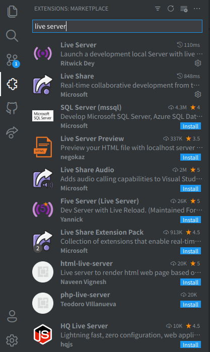

# セットアップ

## 必要なもの

- (Windows の人は) Windows Subsystem for Linux
  - ディストリビューションは Ubuntu がよさそう
- VS Code
  - 拡張機能
    - [Live Server](https://marketplace.visualstudio.com/items?itemName=ritwickdey.LiveServer)
    - [Prettier \- Code formatter](https://marketplace.visualstudio.com/items?itemName=esbenp.prettier-vscode)
- Node.js v12 以上
- yarn

## インストール

インストールされているかの確認と、されていなかった場合のインストール方法です。

### Windows Subsystem for Linux

[Windows 10 に WSL をインストールする \| Microsoft Docs](https://docs.microsoft.com/ja-jp/windows/wsl/install-win10) をご覧ください。

### VS Code

#### 起動方法

各 OS のアプリ一覧から VS Code を探して起動します。

#### インストール方法

[Visual Studio Code 公式サイト](https://code.visualstudio.com/) から、ダウンロードしてインストールします。

例として、 Ubuntu でのインストール方法を下記に示します。

```bash
sudo apt install ダウンロードされた.debファイル
```

また、以下の 2 つの拡張機能をインストールしてください。

- [Live Server](https://marketplace.visualstudio.com/items?itemName=ritwickdey.LiveServer)
- [Prettier \- Code formatter](https://marketplace.visualstudio.com/items?itemName=esbenp.prettier-vscode)

拡張機能の管理画面は、下図のように、VS Code のウィンドウの左側にあるアイコンから開けます。



### Node.js

#### インストールされているバージョンの確認方法

```bash
node -v
```

`v16.7.0` のように表示されれば OK です。

`node` コマンドが見つからない旨のエラーメッセージが表示された場合は、Node.js がインストールされていません。
下記インストール方法を参照し、インストールしてください。

`v12.0.0` 未満のバージョンが表示された場合は更新が必要です。
インストールされた方法に応じて、更新するか、アンインストールして下記インストール方法でインストールするなどをしてください。

#### インストール方法

Node.js には、以下のようなインストール方法があります。
バージョンマネージャは、マシンに複数のバージョンの Node.js をインストールしてプロジェクトによって使用するバージョンを変えるなど、
柔軟に複数の Node.js のバージョンを管理することができるソフトウェアです。
Python の pyenv、Ruby の rbenv など、様々な言語で同様の仕組みはあります。

- [Node.js 公式サイト](https://nodejs.org/ja/) から実行ファイルをダウンロードしてインストールする方法
- Node.js のバージョンマネージャを使用しインストールする方法
  - [nvm](https://github.com/nvm-sh/nvm)
    - Windows を使用する場合は、WSL を使用するか [nvm-windows](https://github.com/coreybutler/nvm-windows) を使用する必要があるそうです
  - [nodenv](https://github.com/nodenv/nodenv)
    - Windows を使用する場合は、WSL を使用する必要があるそうです
  - [n](https://github.com/tj/n)
    - Windows を使用する場合は、WSL を使用する必要があるそうです
  - [Volta](https://volta.sh/)

ここでは、nvm を使用して Node.js をインストールします。
これは、[WSL 2 上で Node\.jis を設定する \| Microsoft Docs](https://docs.microsoft.com/ja-jp/windows/dev-environment/javascript/nodejs-on-wsl) や、後述する [Create React App の公式ドキュメント](https://create-react-app.dev/docs/getting-started#creating-an-app) で紹介されているなど、広く使われているからです。

[nvm の Install & Update Script](https://github.com/nvm-sh/nvm#install--update-script) を実行し、`nvm install node --lts` を実行することで、Node.js の最新 LTS 版がインストールされます。

インストールできたら、もう一度「インストールされているバージョンの確認方法」を実行し、インストールできていることを確認しましょう。

### yarn

#### インストールされているバージョンの確認方法

```bash
yarn -v
```

`v1.22.5` のように表示されれば OK です。

#### インストール

下記のコマンドでインストールできます。
また、すでにインストールしていた人も、下記のコマンドで更新できます。

```bash
npm install --global yarn
```

## まとめ

このセクションでは、環境構築の方法について説明しました。

後のセクションをやっていく上で、うまく動かないなどの問題があれば、このセクションを見返してみてください。
